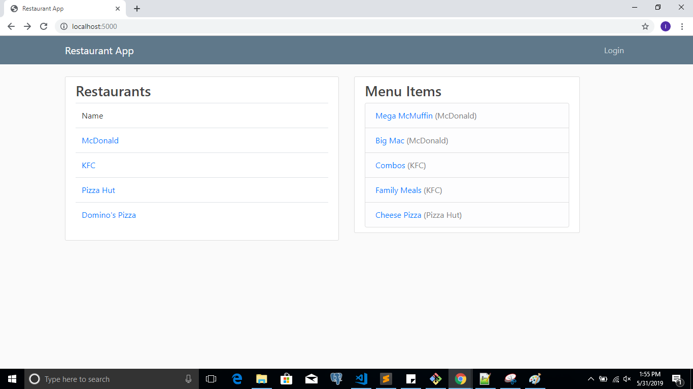
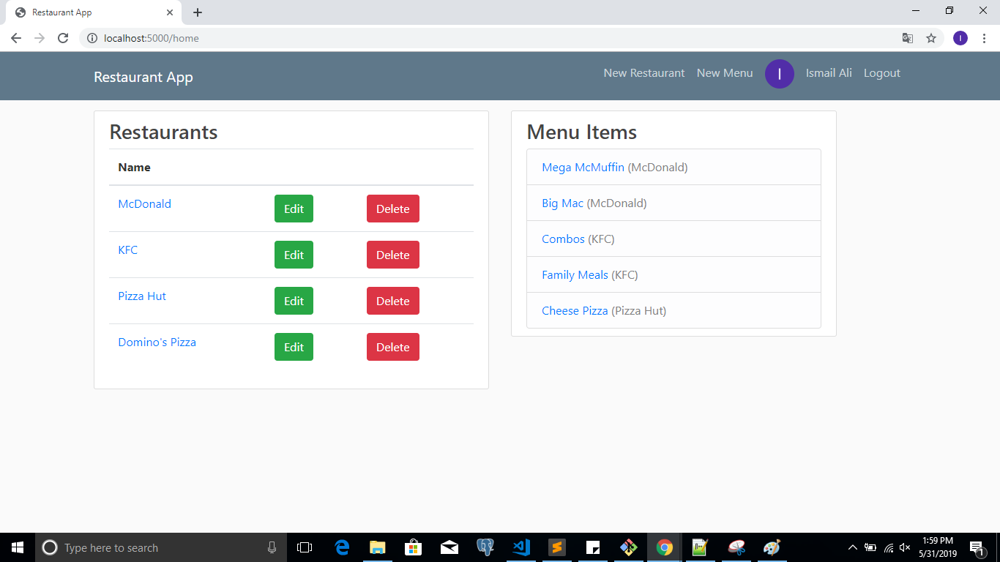
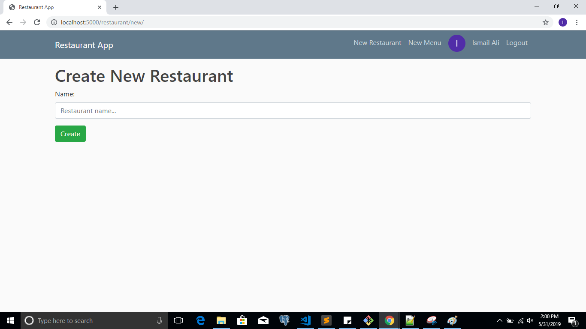
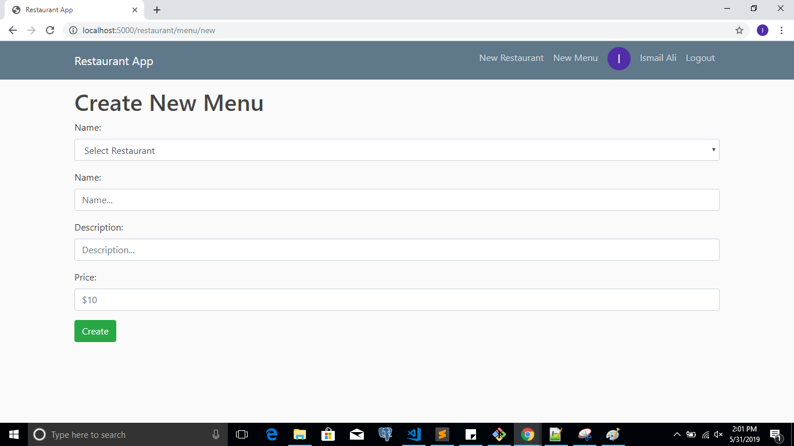
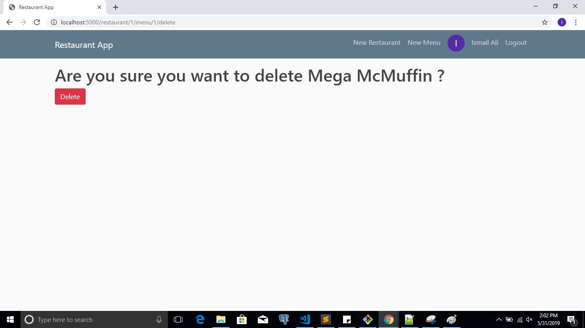
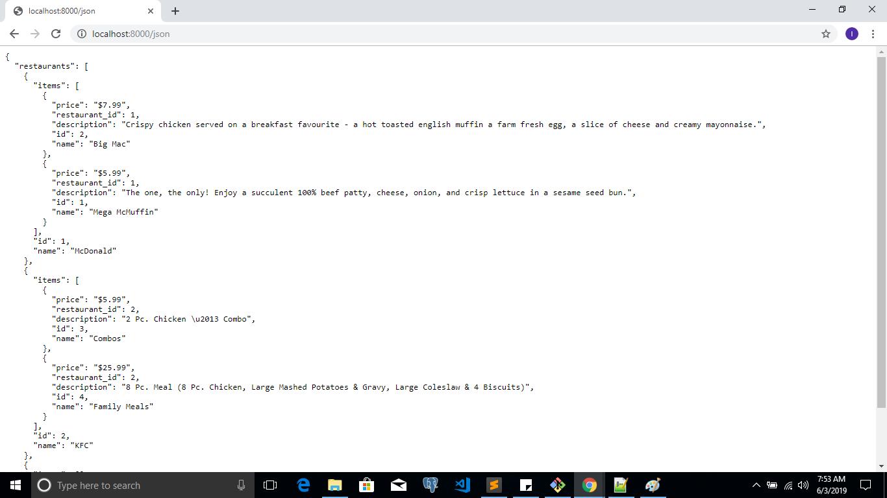

# Project 4: Restaurant App

This is Python Flask CRUD Restaurant Menu App web with SQLite Databse and Google Sign-In, and it is  fourth project of the [UDACITY Full Stack Web Developer Nanodegree]

## Installation

**Step 1:** Download and install Vagrant and VirtualBox

**Step 2:** clone the project folder and open the terminal

**Step 3:**  To Install & Configure VM type cd /vagrant then vagrant up

**Step 4:** To log into machine type vagrant ssh

**Step 4:** to Install & Configure VM

## How to run

**Step 1:** Open your terminal and then run these commands:

**Step 2:** To Launch to machine
- cd /vagrant
- vagrant up
- vagrant ssh

**Step 3:** Open shared folder
- cd /vagrant/catalog 

**Step 4:** Run the program
- python database_setup.py
- python restaurantapp.py

##  Pages Screenshot

### 1. Create new restaurant page

### 2. Create new Menu Item page

### 3. Delete Menu Item

### 3. JSON View

